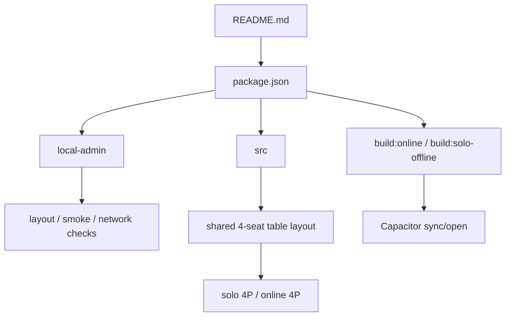

# Mahjong-vite Flowchart

主要流程

- 入口是 `package.json`、`README.md` 與 `src/`。
- `local-admin/` 提供 layout、smoke、network 與遊戲測試。
- 單人 4P 與雙人遊戲 4P 連線模式共用同一個四方牌桌呈現：四家棄牌集中在中央，側邊 card 與中央區域維持等高。
- `build:online` 與 `build:solo-offline` 分成兩條產線。
- Capacitor sync/open 進入 Android / iOS 包裝流程。

重要分支 / 風險

- solo-offline 的 CSS 打包與 Android 工具鏈是主要風險。
- 多人網路流程與 PWA / APK 輸出要分清楚。

依據檔案

- `AGENTS.md`
- `README.md`
- `package.json`
- `capacitor.config.ts`
